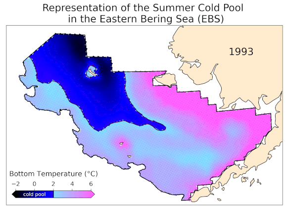

# Welcome to {{hackweek}}!


<br>*Model hindcast of the Bering Sea cold pool from MOM6 (image curtesy of Liz Drenkard, NOAA-GFDL)*

📖 On this JupyterBook website you'll find [lectures](presentations/lectures) and [tutorials](presentations/tutorials). Lectures provide science background for how ocean model data can be used in ocean ecosystem and fisheries contexts. Tutorials can include slides and Jupyter Notebooks, designed to be run interactively, but also rendered on this website for convenience.

👩‍💻 During a Hackweek teams work collaboratively on different projects. Read more about the projects and results on our [projects page](projects/list_of_projects)


```{admonition} Quick links for the event
:class: seealso
* JupyterHub: {{ jupyterhub_url }}
* Slack Workspace: {{ slack_workspace_url }}
* Projects Spreadsheet: {{ '[Hackweek Projects]({url})'.format(url=project_spreadsheet_url) }}
```
